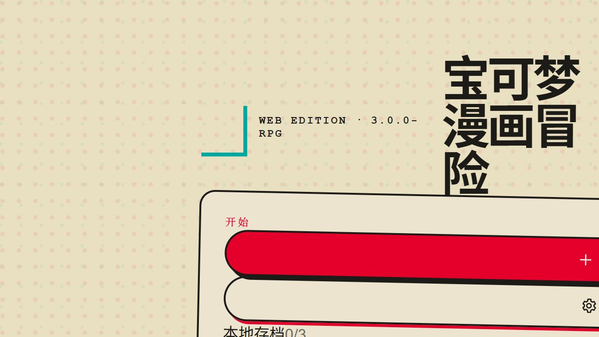

# 宝可梦 AI 漫画冒险

一个运行在浏览器中的宝可梦风格 AI 漫画冒险游戏。

玩家可以创建训练家，在地区中探索、遇见宝可梦、进行快速事件战斗、尝试捕获宝可梦、结识伙伴，并让每一次选择继续推进新的漫画剧情。

当前项目范围为**网页版**，使用静态文件即可运行，不依赖后端服务，也不包含 Android 原生应用构建内容。

## 项目截图



## 当前特色

- 内置智谱剧情与 Agnes 插图双 API 配置，打开网页后即可开始，不需要先填写 API Key。
- 每个冒险回合生成 **4–6 格漫画分镜**，每格包含镜头、构图、动作、叙事、对白和音效信息。
- 每个回合生成一张位于剧情上方的整页动漫风格插图。
- AI 负责生成叙事、选项和事件建议；游戏规则负责处理战斗、捕获、道具和奖励结果。
- 使用“正史规则＋原创主线”：官方地区、地点、宝可梦、类型、道具和设施由本地世界观资料库约束，训练家、伙伴和故事主线保持原创。
- 宝可梦以 `pokemonId` 为唯一依据，图鉴、遭遇卡、剧情文本和插图提示词统一使用同一条中文资料；旧存档会在打开时尝试校正名称、类型和图片。
- 快速事件战斗支持观察、战斗、捕获、使用伤药、逃跑和伙伴协助等行动。
- 三个主要模块：冒险、漫画、故事。
- 五个辅助面板：个人信息、宝可梦图鉴、同行宝可梦、伙伴、背包。
- 轻量任务系统，支持探索、遭遇、战斗、捕获和伙伴相关进度。
- 游戏存档支持本地自动保存、3 个存档槽位、JSON 导入和 JSON 导出。
- 生成的图片独立缓存在 IndexedDB，不会把大尺寸图片直接塞进文字存档。
- 支持 PWA 安装到手机主屏幕；网页部署后可以像应用一样启动。

## 快速开始

### 本地运行

项目是静态网页，建议通过本地 HTTP 服务运行：

```bash
cd pokemon-ai-adventure
python3 -m http.server 8080
```

Windows 也可以使用：

```powershell
cd pokemon-ai-adventure
py -m http.server 8080
```

然后在浏览器打开：

```text
http://localhost:8080
```

如果需要用手机调试，请让电脑和手机连接同一个 Wi-Fi，并访问：

```text
http://<电脑IP>:8080
```

也可以使用其它静态服务器，例如：

```bash
npx serve .
```

### 开始游戏

1. 点击“新的冒险”。
2. 只输入训练家名称和性别，地区、故乡、年龄、性格和外观会随机生成。
3. 点击“出发”，开始生成第一回合剧情。
4. 在冒险页面查看整页插图、漫画分镜、遭遇状态和下一步选项。
5. 通过底部导航切换冒险、漫画和故事模块。
6. 点击“更多”访问个人信息、图鉴、宝可梦、伙伴和背包。

网页默认使用双 AI 通道，可以直接开始：智谱 AI 负责文字剧情和漫画分镜，Agnes AI 负责整页动漫插图。如果需要更换服务，可以在 AI 设置中分别覆盖两个通道的接口地址、模型和 API Key。

## 游戏模块

### 页面布局

- 桌面端采用“旅行目录＋漫画主舞台＋行动侧栏”的三段式结构：左侧切换冒险和资料模块，中间阅读插图与分镜，右侧查看旅程、遭遇、任务和下一步行动。
- 手机端回到单列阅读，依次显示回合标题、插图、分镜、旅程状态、遭遇与选择；底部导航保留主要模块，“更多”展开辅助面板。
- 插图使用中等高度，不会长期占满首屏；生成后默认折叠，玩家可以手动展开查看。

### 冒险

冒险页面按照以下顺序呈现：

1. 当前地区、地点和回合状态。
2. 本回合整页动漫风格插图。
3. 4–6 格漫画分镜剧情。
4. 当前宝可梦遭遇或战斗状态。
5. 下一步行动选项。

如果插图生成失败，剧情和分镜仍会保留，可以单独点击“重新生成插图”。

### 漫画

漫画模块会收录已经完成的冒险回合，展示：

- 每回合整页插图。
- 本回合的分镜数量和镜头类型。
- 分镜剧情摘要。
- 插图生成中、生成失败和重新生成状态。

### 故事

故事模块按每 8 个回合整理章节，可以回顾冒险文字，并将当前故事导出为 Markdown 文件。

### 图鉴、队伍、伙伴和背包

- **图鉴**：记录实际遇到过的宝可梦，显示名称、属性、遇见次数和捕获状态。
- **宝可梦**：显示当前同行队伍，队伍上限为 6 只，并显示等级、生命值和经验相关状态。
- **伙伴**：记录同行人物、关系值和伙伴信息。
- **背包**：管理精灵球、伤药、奖励道具和其它冒险物品。
- **个人信息**：显示训练家、地区、地点、回合、队伍、战斗、捕获和任务进度。

## 快速事件战斗

战斗不是复杂的传统回合制操作，而是服务于剧情推进的快速事件判定。

常见行动包括：

- 观察当前遭遇。
- 进行战斗，尝试削弱对方。
- 使用精灵球进行捕获。
- 使用伤药恢复队伍状态。
- 逃离遭遇。
- 请求同行伙伴协助。

规则引擎会校验当前是否存在遭遇、背包中是否有对应道具、捕获是否成功、队伍是否达到上限，以及战斗和任务奖励如何变化。

遭遇不是每回合必然出现。剧情模型需要提供声音、足迹、任务或地点等触发原因，且两次新遭遇之间有冷却；模型不能直接宣布捕获、奖励或战斗结果。

## 正史世界观资料库

`assets/world-data.js` 是网页端的世界观入口，包含九大地区的官方中文名称、代表性城镇/道路/地标、栖息地、设施、类型和道具词表，以及常用宝可梦的标准中文名、英文标识、类型和官方立绘入口。剧情生成器会根据当前地区注入 `WORLD_BIBLE`，规则层会拒绝当前地区不存在的地点、未知道具、无效编号和没有合法触发原因的遭遇。

当前实现保留 PokéAPI 作为未命中本地常用资料时的统一资料适配器；资料返回后会缓存，并以编号对应的中文名和图片覆盖 AI 或旧存档中的错误名称。

## 存档与图片缓存

游戏状态会自动保存在当前浏览器中，另有 3 个可手动管理的存档槽位。

- 本地存档：保存训练家、剧情、队伍、图鉴、伙伴、背包、任务和遭遇状态。
- JSON 导出：在本地存档面板中导出完整游戏状态。
- JSON 导入：选择之前导出的 JSON 文件恢复冒险。
- 图片缓存：插图通过 IndexedDB 单独缓存，游戏状态只记录图片引用，不直接保存大尺寸 Base64 图片。
- 清理浏览器站点数据可能会删除本地存档和图片缓存，请在清理前先导出 JSON 存档。

## 网页部署与 PWA 安装

项目可以部署到任意静态托管平台，例如 GitHub Pages、Vercel、Netlify 或 Cloudflare Pages。

部署后：

- Android Chrome/Edge 可以通过浏览器菜单选择“添加到主屏幕”或“安装应用”。
- iPhone/iPad Safari 可以通过分享菜单选择“添加到主屏幕”。
- Service Worker 会缓存网页壳和部分已访问资源。
- AI 剧情和插图生成仍需要网络连接；已经缓存的图片和已保存的文字状态可以在本地继续查看。

## 项目结构

```text
pokemon-ai-adventure/
├── index.html                 # 网页入口、PWA 元信息和脚本加载
├── manifest.webmanifest       # PWA 安装清单
├── sw.js                      # Service Worker 与静态资源缓存
├── pwa.js                     # Service Worker 注册和安装提示
├── assets/
│   ├── app.js                 # 页面渲染、AI 调用、交互和存档流程
│   ├── game-rules.js          # 快速战斗、捕获、道具和队伍规则
│   ├── world-data.js           # 官方地区、地点、词表和宝可梦资料入口
│   ├── media-store.js         # 图片 Blob 的 IndexedDB 缓存
│   ├── app.css                # 桌面端和基础视觉样式
│   └── mobile.css             # 移动端布局和导航适配
└── icons/                     # 网页和 PWA 图标
```

## 技术说明

- 原生 JavaScript、HTML 和 CSS，无构建步骤。
- AI 接口采用 OpenAI 兼容的 Chat Completions 请求格式。
- 默认使用智谱 AI 文字模型 `glm-4.7-flash` 生成中文剧情和结构化分镜。
- 默认使用 Agnes AI 图像模型 `agnes-image-2.1-flash` 生成整页插图，Base URL 为 `https://apihub.agnes-ai.com/v1`；图像请求使用官方示例尺寸 `1024x768`。
- 两个通道都采用 OpenAI 兼容请求格式；剧情 API 与插图 API 的配置、密钥和失败状态相互独立。
- 宝可梦资料和立绘来自 [PokéAPI](https://pokeapi.co)，并通过浏览器缓存减少重复请求。
- 正史名称和世界观边界由 `assets/world-data.js` 统一注入；PokéAPI 仅作为未命中本地资料时的补充来源。
- 游戏状态使用浏览器本地存储管理，图片使用 IndexedDB 独立缓存。
- 页面默认采用 Lo-Fi 纸张、漫画印刷、粗线条和高对比色彩视觉方向。

## 注意事项

- 本项目是单机浏览器网页，存档默认只保存在当前浏览器和设备中。
- 内置 API 方便个人直接体验；如果公开部署给多人使用，建议自行更换为受控的 API 配置或增加后端代理。
- 本项目当前只维护网页版，Android 原生工程不在本次功能范围内。
